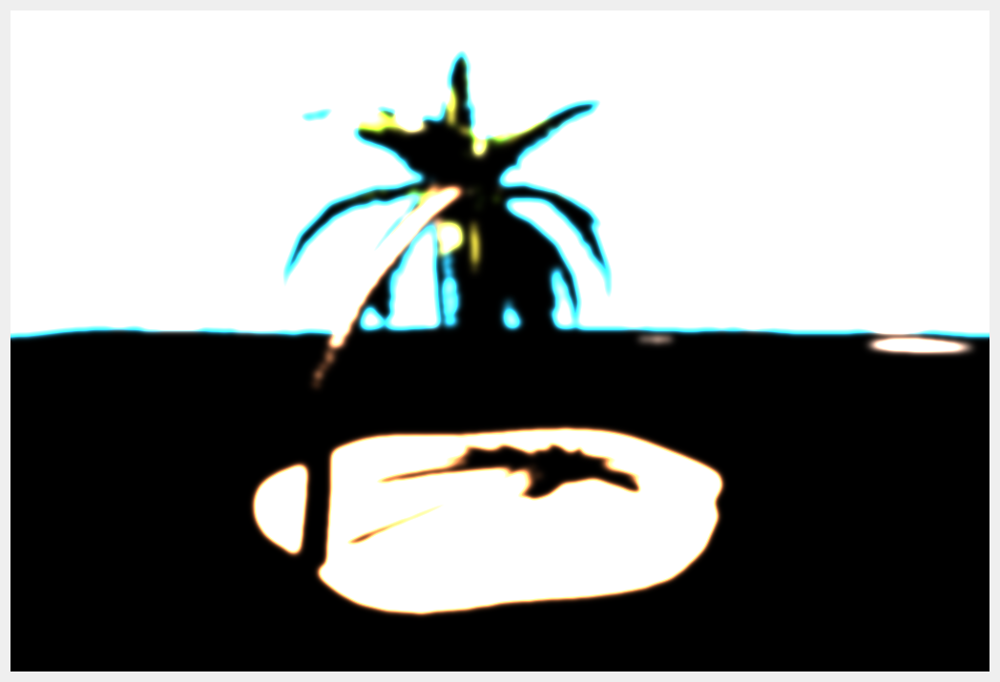
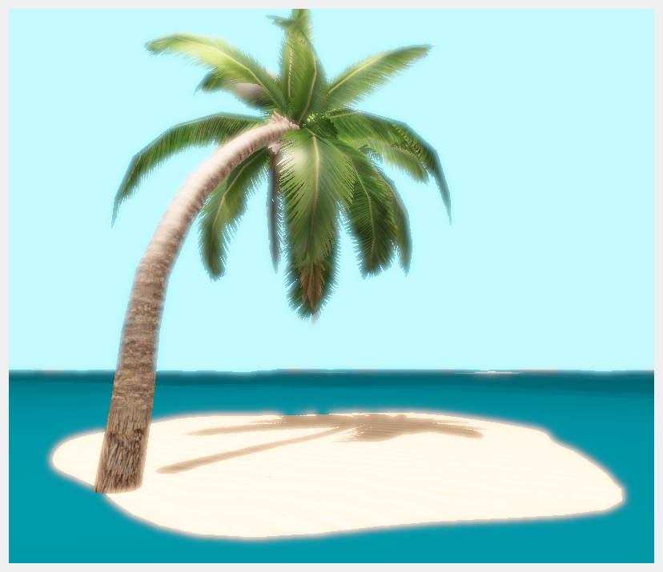
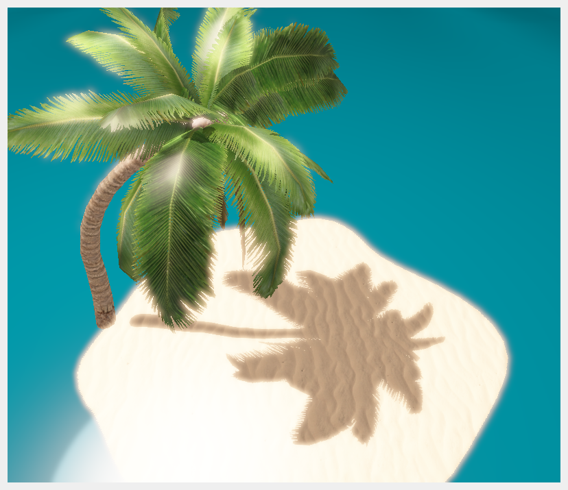
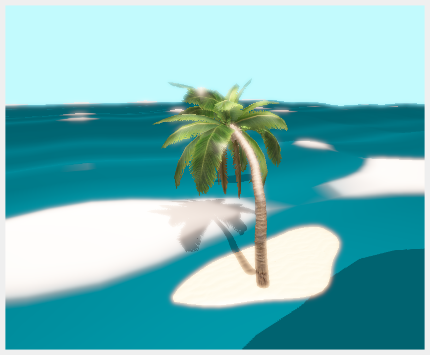
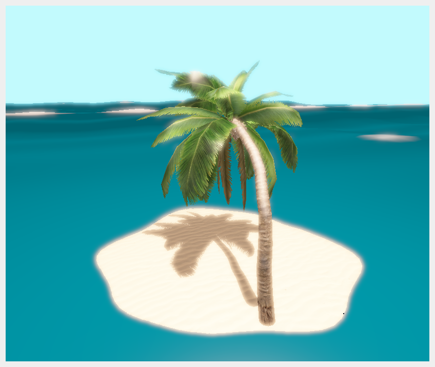

# Isolation

Let's face it: this is where we all wish we could be right now.

_Isolation_ is an experiment of what can be achieved with _framebuffers_, with a sprinkle of procedural animations.

All of the meshes and textures used in this project are either royalty-free, or were created by myself.

## Building instructions

The project is based on OpenGL3, and as such, the build instructions are the same for both. Simply open the `Isolation.pro` project in the Code folder with QtCreator, and build the project in either debug or release mode.

## Moving about

You can rotate around the scene by clicking and dragging the mouse, as well as zooming with the scroll wheel. Press the R key to reset the view to its starting position.

## HDR / Bloom

By rendering to a floating-point framebuffer, one can produce colors exceeding the [0.0, 1.0] range. The range of visible colors can then be adjusted through a fragment shader, using a so-called _exposure_ parameter.  
Since we can now encode really bright pixels in the image, we can extract pixels exceeding a specified brightness, blur them, and then add them back in the image. This achieves the effect of soft, smooth lighting commonly referred to as _bloom_.

|                                                                            |  |
| :------------------------------------------------------------------------------------------------------: | -------------------------- |
| The contents of the bloom buffer. Only the brightest parts are visible, and they have been smoothed out. | The final result.          |

## Shadow mapping

Rendering the scene an additional time, in the perspective of the light, allows us to store the depth of the object relative to the light. We can then use this information when rendering the scene from the camera's perspective to determine whether an object is directly lit by the light source, or occluded by some other object, depending on whether the object's depth in light-space is less than the one stored in the shadow buffer.

## Procedural animation

Water is rendered in a similar way to OpenGL assignment 3, but a wave pattern is applied in both directions, with different amplitudes, phases and frequencies, acheiving a more complex surface. Of course, this also complicates the calculation of the surface's normal vector, which now has to compute two partial derivatives.

Simply applying this effect to all of the water's surface, however, produced undesirable results, as the water would clip through the island's mesh. To avoid that, the surface's wave offset is scaled through a grayscale texture, containing a circular gradient in the spot where the island is located.

|    |                      |  |
| :--------------------------------: | --------------------------------------------------- | -------------------------------- |
| Water clipping through the island. | The gradient texture used to scale the wave offset. | The final result.                |

As a final touch, the palm tree's leaves are also swayed in a similar way to the water, though with different coefficients, and the offset is applied in all three dimensions.
